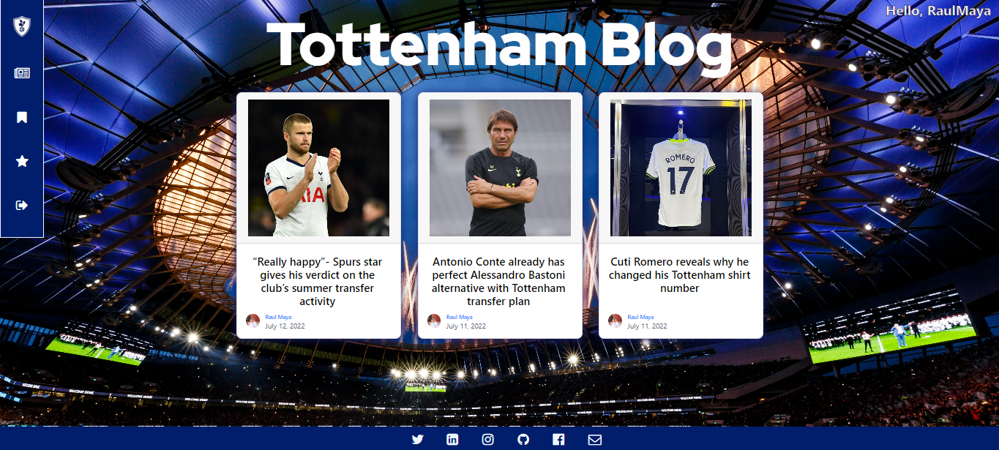

<!-- PROJECT LOGO -->
 

  

  <h2 align="center">Tottenham Hotspurs: Django Blog</h2>

This project is a Django Blog App about my favorite soccer team Tottenham Hotspurs. The objective of this project was to develop and challenge my Django skills, in an interactive and entertained way. In this application, you can read my opinions about Tottenham Hotspurs news, and also you can create your account and save your favorite posts or your read later posts.
     
     
    <a href="https://github.com/RaulMaya/Spurs-Blog">Repository</a>
    ·
    <a href="http://tottenhamblog-env-1.eba-4xb2gdij.us-east-1.elasticbeanstalk.com/ ">AWS Deployment</a>
    ·
    <a href="https://udemy-certificate.s3.amazonaws.com/pdf/UC-65737e98-ce95-4c12-bcb0-e86c5d1623fd.pdf">Course Project Certification</a>
  

<!-- ABOUT THE PROJECT -->
### Project Covered Django Topics

1. Understanding URLs, views, requests and responses
2. Working with templates and static files like CSS and images
3. Working with data and models
4. Connecting data with relationships (one-to-many, one-to-one, many-to-many)
5. Querying data with Django's powerful model solution
6. Adding administration panels to your projects
7. Handling user input with forms - manually and with Django's built-in form support
8. Advanced features like class-based views (and when to use them)
9. Dealing with file uploads and how to serve uploaded files
10. Working with sessions
11. User authentication
12. In-depth deployment instructions and examples
13. Different ways of deploying and serving static files and user uploads

(<a href="#top">back to top</a>)

### About The Project

This projects is about a soccer team (Tottenham Hotspurs) blog. This blog runs using Django as framework and Python as programming language, also it covers very important and interesting Django topics. The blog is deployed using AWS: elastic-beanstalk, buckets and PostgreSQL DB.

The index provides you with the latest 3 published posts, you can access on detail to any of those posts by clicking on any of them.

Also you have the navigation menu, and if you are not logged in you will have the option to explore all the published posts, log in or register.

In case the guest doesn't have an account, the guest can go to the register button in the menu navigator, and fill the form to create the user account. The registration process is based on a Django authentication model, and it is very easy to fill, you just need to satisfy certain requirements on the password.

If you already have an existing account, you are good to go to login by using your account and your selected password.

In the other hand if you are logged in you will be able to store your posts into a read later or favorites label. This helps the users to follow the track of posts they want to read or their favorite ones.

Also, at the bottom of every post there is a comment form, in which anyone that visits the page can comment and share their opinions, critics and ideas about the specific post.

(<a href="#top">back to top</a>)
(<a href="#top">back to top</a>)

